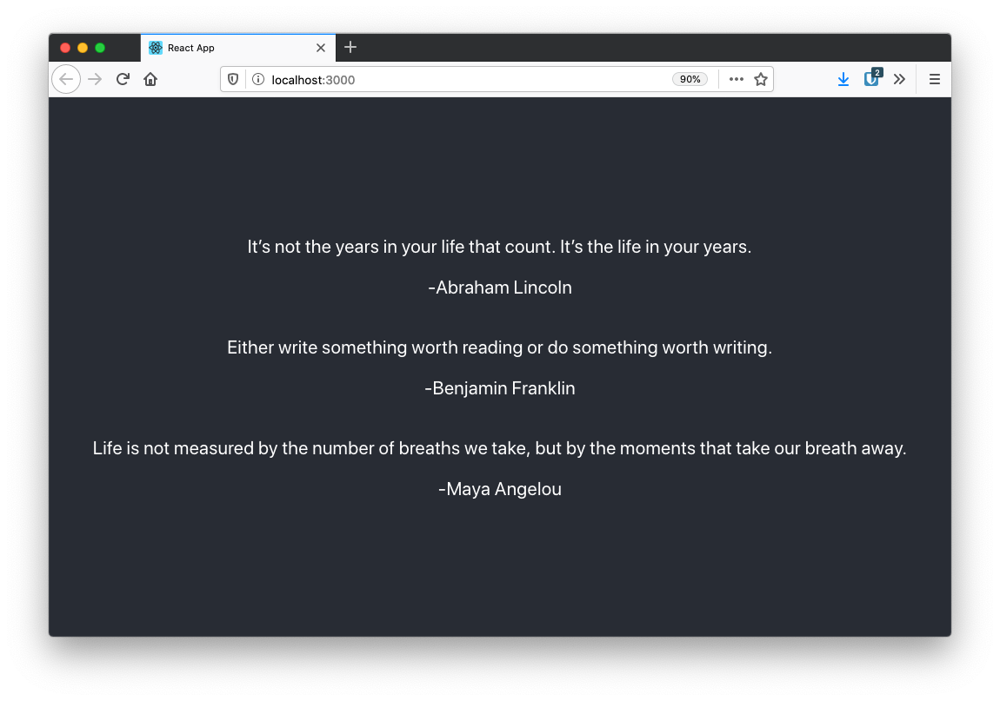

# Création d'une application React

Ce projet à pour but de vous faire construire une
application React avec des components et l'utilisation
de props pour envoyé des informations au components.

# Instructions

Cloner le projet dans votre environnement local.
Ensuite, exécuté `npm install` pour faire l'installation de React pour le projet.
Le projet peux ensuite être exécuté avec `npm start`.

# But
Vous devez créé une application qui va afficher
3 citations trouvé de manière aléatoire à partir d'une
liste de citation fourni.

# Élément fourni
Le dossier présent à été créé avec create-react-app avec quelques
modification :
* Ajout d'un fichier quotes.json contenant les citations.
* Modification de [App.js](src/App.js) pour importer le fichier json
en constante dans celui-ci.

# Pour tester
Vous pouvez utiliser la commande `npm test` pour tester le bon fonctionnement de votre projet.

# Exemple du projet terminer
(Les citations change à chaque refresh)

